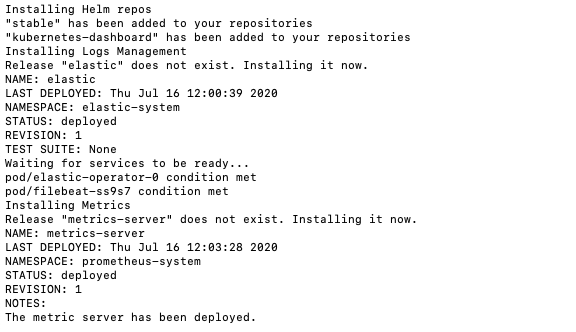
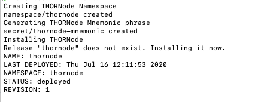

# Quick Outline
## 1. Overview & prerequisites
## 2. Install local tooling
   [2.1 linode-cli](#install linode-cli via PyPI:)
   
   [2.2 kubectl](#install kubectl using native package management)
   
   [2.3 helm + plugins]()

## 3. Provision LKE cluster
## 4. Fetch & merge kubeconfig
## 5. Clone node-launcher repo
## 6. Deploy platform tools (Prometheus, Loki, Dashboard)
## 7. Deploy THORNode stack
## 8. Verify & join the network
## 9. Debugging cheatsheet
## 10. Tear-down / cleanup


# Setup - Linode
Setting up a Kubernetes Cluster with Linode (linode)

## Deploy a Kubernetes cluster in Linode using LKE service.

### Install linode-cli via PyPI:
`pip3 install linode-cli --upgrade`

### Use  API token to grant linode-cli access to your Linode account. Pass in the token when prompted by linode-cli.

`linode-cli`

### Install kubectl using native package management 
Update the apt package index and install packages needed to use the Kubernetes apt repository:

```bash
sudo apt-get update
# apt-transport-https may be a dummy package; if so, you can skip that package
sudo apt-get install -y apt-transport-https ca-certificates curl gnupg
```

Download the public signing key for the Kubernetes package repositories. The same signing key is used for all repositories so you can disregard the version in the URL:

```bash
# If the folder `/etc/apt/keyrings` does not exist, it should be created before the curl command, read the note below.
# sudo mkdir -p -m 755 /etc/apt/keyrings
curl -fsSL https://pkgs.k8s.io/core:/stable:/v1.33/deb/Release.key | sudo gpg --dearmor -o /etc/apt/keyrings/kubernetes-apt-keyring.gpg
sudo chmod 644 /etc/apt/keyrings/kubernetes-apt-keyring.gpg # allow unprivileged APT programs to read this keyring
```

Add the appropriate Kubernetes apt repository. If you want to use Kubernetes version different than v1.33, replace v1.33 with the desired minor version in the command below:

```bash
# This overwrites any existing configuration in /etc/apt/sources.list.d/kubernetes.list
echo 'deb [signed-by=/etc/apt/keyrings/kubernetes-apt-keyring.gpg] https://pkgs.k8s.io/core:/stable:/v1.33/deb/ /' | sudo tee /etc/apt/sources.list.d/kubernetes.list
sudo chmod 644 /etc/apt/sources.list.d/kubernetes.list   # helps tools such as command-not-found to work correctly
```

Update apt package index, then install kubectl:

```bash
sudo apt-get update
sudo apt-get install -y kubectl
```

### Deploy Kubernetes Cluster
Use the commands below to deploy a Kubernetes cluster.

You can run the make command that automates those command for you like this:

`make linode`

### Configure kubectl
Now that you've provisioned your Kubernetes cluster, you need to configure kubectl.Use the following command, 
substituting the ID of your cluster.

```bash
# Store it
linode-cli lke kubeconfig-view <use_your_cluster_id> > ~/.kube/config-linode
```

Check your cluster is responding correctly by running the command:
```bash
kubectl version
kubectl get nodes
```
(Added by ChatGPT) Verify kubectl can reach the cluster:
`KUBECONFIG=$HOME/.kube/config-linode kubectl get nodes -o wide`

(Added by ChatGPT) Keep all THORNode resources in their own namespace
```bash
kubectl create namespace thornode
kubectl config set-context --current --namespace thornode
```

### Clean up your workspace
To destroy and remove previously created resources, you can run the command below.

`make destroy-linode`

# Deploying
Deploying a THORNode and its associated services.

### Deploy THORNode services
Now you have a Kubernetes cluster ready to use, you can install the THORNode services.
> Helm charts are the defacto and currently easiest and simple way to package and deploy Kubernetes application. The 
> team created different Helm charts to help to deploy all the necessary services. Please retrieve the source files from the Git repository here to follow the instructions below: https://gitlab.com/thorchain/devops/node-launcher

Clone the node-launcher repo. All commands in this section are to be run inside of this repo:

```bash
git clone https://gitlab.com/thorchain/devops/node-launcher
cd node-launcher
git checkout master
```

Install Helm 3 if not already available on your current machine:

```bash
make helm
make helm-plugins
```

To deploy all tools, metrics, logs management, Kubernetes Dashboard, run:

`make tools`

You need to give the deployment a namespace name, `thorchain` is used in the example below. If you are successful, 
you will see the following message:



If there are any errors, they are typically fixed by running the command again.

> `make help` will list all commands available. See https://gitlab.com/thorchain/devops/node-launcher/-/blob/master/README.md for more information.

### Deploy THORNode

It is important to deploy the tools first before deploying the THORNode services as some services will have metrics configuration that would fail and stop the THORNode deployment.

You have multiple commands available to deploy different configurations of THORNode. The commands deploy the 
umbrella chart `thornode-stack` in the background in the Kubernetes namespace `thornode` by default. This 
configuration is for running a fullnode with midgard:

```bash
NET=mainnet TYPE=fullnode NAME=thornode make install
```

If successful, you will see the following:




You are now ready to join the network:

### Debugging
> Set `thornode` to be your default namespace so you don't need to type `-n thornode` each time: 
 
`kubectl config set-context --current --namespace=thornode`

Use the following useful commands to view and debug accordingly. You should see everything running and active. Logs can be retrieved to find errors:

```bash
kubectl get pods -n thornode
kubectl get pods --all-namespaces
kubectl logs -f <pod> -n thornode
```

Kubernetes should automatically restart any service, but you can force a restart by running:

`kubectl delete pod <pod> -n thornode`

### CHART SUMMARY
THORNode full stack / chart 

* thornode: Umbrella chart packaging all services needed to run a fullnode or validator THORNode.

This should be the only chart used to run THORNode stack unless you know what you are doing and want to run each chart separately (not recommended).

THORNode services:
* thornode: THORNode daemon

* gateway: THORNode gateway proxy to get a single IP address for multiple deployments

* bifrost: Bifrost service

* midgard: Midgard API service

Tools

* prometheus: Prometheus stack for metrics

* loki: Loki stack for logs

* kubernetes-dashboard: Kubernetes dashboard

